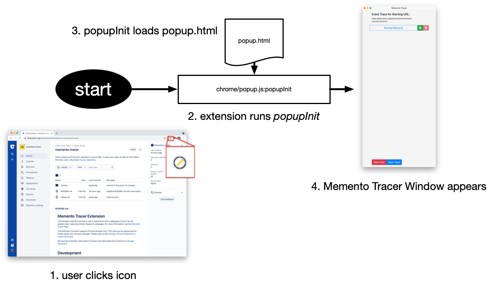
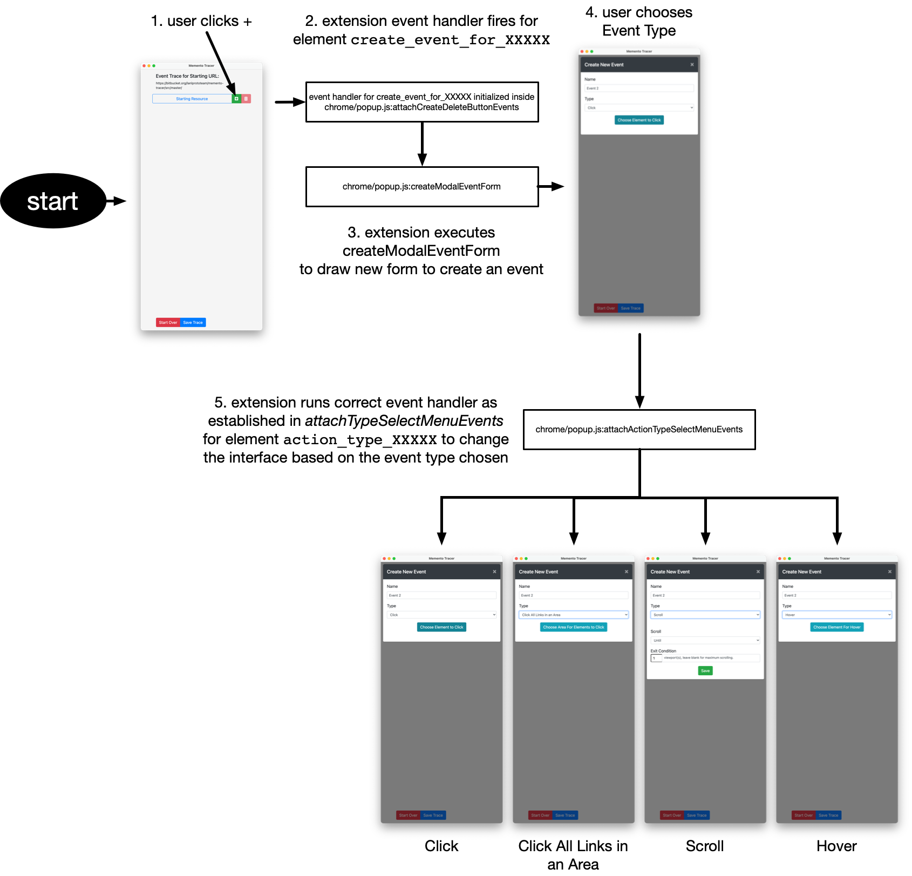
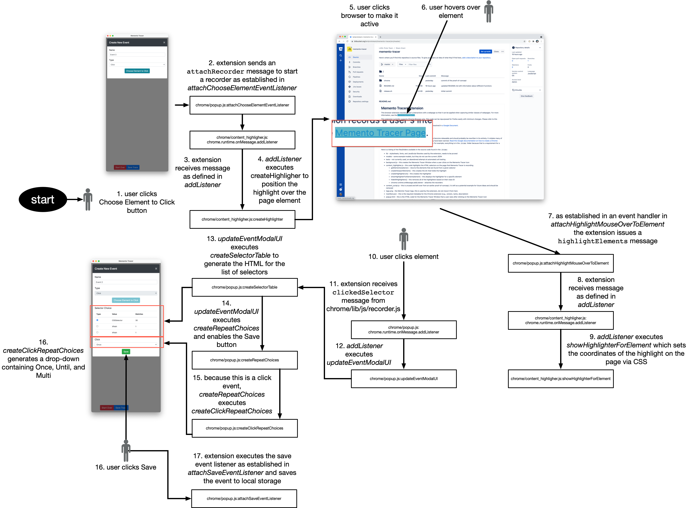

#LANL c number C22055
© 2022. Triad National Security, LLC. All rights reserved.
This program was produced under U.S. Government contract 89233218CNA000001 for Los Alamos
National Laboratory (LANL), which is operated by Triad National Security, LLC for the U.S.
Department of Energy/National Nuclear Security Administration. All rights in the program are
reserved by Triad National Security, LLC, and the U.S. Department of Energy/National Nuclear
Security Administration. The Government is granted for itself and others acting on its behalf a
nonexclusive, paid-up, irrevocable worldwide license in this material to reproduce, prepare
derivative works, distribute copies to the public, perform publicly and display publicly, and to permit
others to do so.

# Memento Tracer Extension


This browser extension records a user's interactions with a webpage so that it can be applied 
when capturing similar classes of webpages. For more information, 
see the [Memento Tracer Page](http://tracer.mementoweb.org/).

This extension currently supports Chrome Browser only. This code can be repurposed for Firefox 
easily with minimum changes. Please refer to this 
[Porting a Chrome Extension to Firefox document](https://developer.mozilla.org/en-US/docs/Mozilla/Add-ons/WebExtensions/Porting_a_Google_Chrome_extension).

We have documented a discussion of issues to be discussed and resolved in [a Google Document](https://docs.google.com/document/d/1gFxNeuK7BSJLm56Vt9RH4yw90YMK55IkSpIKb0FCMSI/edit?usp=sharing).

# Development

Memento Tracer is very much a prototype. It needs a lot of work to become releasable and should probably be rewritten in its entirety. It violates many of the principles of model-view-controller and similar paradigms. You have been warned. [Read this Google documentation on how to create a Chrome extension](https://developer.chrome.com/docs/extensions/mv3/getstarted/) in order to fully understand why it is structured this way. For example, everything is in the `chrome` folder because that is a requirement for a Chrome extension.

Here is a listing of the files/folders available in the source code found in the `chrome`:

* lib - stylesheets, fonts, and JavaScript libraries used by the extension, needs to be pruned
* models - some example models, but they do not use the current JSON
* tests - not currently used, an abandoned attempt at automated unit testing
* background.js - this creates the Memento Tracer Window when a user clicks on the Memento Tracer icon
* content_highlighter.js - this code highlights the HTML selectors on the page that Memento Tracer is recording
    * getElements(selector) - returns the elements that are found from a given selector
    * createViewportElement() - this creates the div that holds the highlight
    * createHighlighter(cls) - this creates the highlighter
    * showHighlighterForElement(element) - this displays the highlighter for a specific element
    * hideAllHighlighters() - this removes all of the highlighters based on their class ID
    * chrome.runtime.onMessage.addListener - attaches the recorders
* content_script.js - this is unused and left over from an earlier proof-of-concept, it is left as a potential example for future ideas but should likely be removed
* logo.png - the Memnto Tracer logo, this is used by the extension, do not move it from here
* manifest.json - this is the required metadata for the Chrome extension (e.g., version, name, description)
* popup.html - this is the HTML code for the Memento Tracer Window that a user sees after clicking on the Memento Tracer icon
* popup.js - this houses the code that saves the traces to JSON, some classes and functions of interest include:
    * Trace - this is the class that stores the trace
    * Trace::constructor - initializes the trace name, the JavaScript Object of location URLs, the actions recorded, the URL pattern, and the regex of the URL
    * Trace::locationUrls(locationUrl) - adds a new location URL
    * Trace::locationUrls() - returns the JavaScript Object of location URLs
    * Trace::addTracerEvent(tracerEvent) - adds an event to the existing Trace
    * Trace::getTracerEvent(eventId, actions, existingQueue) - gets the given Tracer event based on eventId, the other two arguments are optional and have default values
    * Trace::getShortestPath(eventId) - returns the shortest path to an event as a JavaScript Object
    * Trace::deleteEvent(eventId) - removes an event from the Trace
    * Trace::actions() - returns the JavaScript Object of actions in the trace
    * Trace::browserInfo() - returns the user agent string and the resource URL
    * Trace::getResourceURLfromStorage() - gets the current URL for a trace from the previous time this extension was run on the same page
    * Trace::toJSON() - converts the trace to its JSON format
    * Trace::fromJSON() - reads an existing trace from JSON format - may not be used yet
    * TracerEvent - this class contains information about the event in a Trace
    * TracerEvent::constructor - initializes the event name, action name, resource URL, a parent Trace ID (if any), a current event ID, and in which order this event will be placed in the trace
    * TracerEvent::info() - returns a TracerEvent as a JavaScript Object
    * TracerEvent::createEventID() - randomly generates an ID for the Tracer Event
    * TracerEvent::updateEventName(newEventName) - allows one to change the event name
    * createNewEventMetadata(parentId) - aptly named, it creates new event metadata
    * createStartingResourceTrace(resUrl) - creates a new parent trace from the resource URL
    * getWidthForEvent(event, depth) - depending on where the event is in the tree, its button is a different size to give a "tree-like" effect; this function computes the width of the button based on the depth of the event in the tree
    * getActionsByEventOrder(actions) - sorts the events by the order in which they were originally created, largely when loading a trace from storage
    * getItemsFromStorage() - loads the events from storage, but with a Promise, which means that it will happen aschronously
    * updateEvent - this updates the event with the selector that the user chooses
    * cache(fn) - caches the asynchronous storage lookup
    * createRegExpForPattern(patternUrl) - creates a regex for the pattern URL
    * createEventTypeChoices(event_id, action_type, asStr) - generates the HTML for the drop-down list of events to record (Click, Click All Links in Area, Scroll, Hover)
    * createClickMultiCondition(event_id) - used for Traces that require returning to a previous page; after a user chooses "Click", chooses a selector, and then chooses the "Multi" condition, this function generates the HTML that offers them an "End Condition" either to click the browser back button or to choose another selector that will act as a back button
    * createClickExitCondition(event_id, asStr) - used for paging Traces; after a user chooses "Click", chooses a selector, and then chooses the "Until" condition, this function generates the HTML that offers them the different exit conditions (e.g., element with selected number is reached)
    * createScrollExitCondition(event_id, asStr) - used for scrolling Traces; after a user chooses "Scroll", this function generates the HTML that offers them the exit condition requesting how many viewports to scroll
    * createSelectorTableForExitCondition(selectorInfo, eventId, readonly) - a duplicated function that needs to be resolved; 
    * updateExitCondition(selectors)
    * createSelectorTable(selectorInfo, eventId, readonly, savedSelectors) - generates the HTML that lists the selectors available for the user to choose from
    * createRepeatChoices(event) - for a given event, generates the appropriate "repeat" HTML code depending on the event type; for example, with "Click", it will call createClickRepeatChoices to generate the "Once", "Until", and "Multi" options
    * createScrollRepeatChoices(event_id) - generates the HTML for the appropriate repeat choices for "Scroll" (e.g., Until)
    * createSelectAllLinksRepeatChoices(event_id) - after a user chooses "Click All Links in an Area" and chooses a selector, this function generates the HTML for the click choices, currently "Once"
    * createClickRepeatChoices(event_id) - after a user chooses "Click" and chooses a selector, this function generates the HTML for the click choices, currently "Once", "Until", and "Multi"
    * attachScrollSelectorMouseOverEvents(event) - highlights the viewport of a scroll window for the "Scroll" event type
    * attachScrollButtonMouseOverEvents(event) - places a hightlight over the viewport when a user hovers over the "Exit Condition" portion of a "Scroll"->"Until" window
    * attachExitSelectorMouseOverEvents(event) - places a higlight over the elements chosen for "Click"->"Until" if the exit condition is controlled by a specific number of pages whose value exists in an element on the page
    * attachHighlightMouseOverToElement(selectorElement, i, event) - controls highlighting of elements for "hover"
    * attachSelectorMouseOverEvents(event) - highlights matched elements after a user has chosen selectors for a "Click" event type
    * createModalEventViewer(event) - generates the HTML for an already saved event
    * createModalEventForm(event) - generates the HTML for the form after a + is created to create a new event
    * createModalDownloadViewer(resource_url) - generates the HTML shown after the "Save Trace" button is clicked
    * updateEventModalUI(event, chosenSelectors) - refreshes the UI when events are created or deleted
    * createEventButtons(event, width_class, insertCopiedTrace, outLink) - generates the HTML for each  button corresponding to an event
    * createEventUI(actions, resource_url, copiedTrace) - generates the HTML for the main UI window after a user clicks the extension button on the browser
    * attachInsertButtonEvent(event, copiedTrace) - support for inserting partial traces, **this code may not be used anymore**
    * attachCreateDeleteButtonEvents(event) - adds the "Create Event" + and "Delete Event" trash can icons as well as event listeners to those buttons to the form HTML
    * attachModalCloseEvents(eventId) - turns off existing highlights when a "Creat Event" + button is clicked
    * attachSaveEventListener(eventId) - generates the Event data, including selector information, once a user clicks "Save" after creating a new event
    * attachChangeExitConditionListener(eventId) - creates a button that allows the user to select the element for an exit condition when a 
    * attachChangeMultiConditionListener(eventId) - creates a button that allows a user to select the element for an exit condition to the "Click" then "Until" event type
    * attachActionTypeSelectMenuEvents(event) - loads the appropriate function when a user selects a different event type (e.g., "Scroll", "Hover")
    * attachClickUntilExitConditions(eventId) - loads the appropriate function to draw the HTML and handle selector choices when a user chooses between "Until", "Multi" and "Once" for the "Click" event type
    * attachChooseTotalPagesEventListener(eventId) - starts recording the click for the maximum number of pages to crawl for paging Traces (e.g., Slideshare)
    * attachEndClickEventListener(eventId) - starts recording when a user needs to choose a selector for a "Multi" click end condition
    * attachChooseElementEventListener(eventId) - starts recording of clicks or hovers for the page
    * sendMessageToActiveTab(message) - sends a message to the tab being recorded
    * popupInit(onTabActivated) - initializes the extension with defaults or loaded data when a user activates the extension for a page - **the extension starts here**
    * chrome.storage.onChanged.addListener - listens and updates the extension storage while a user is creating the Trace

# Execution Path Examples

We cannot show execution paths for all cases, but below we show a few common cases to help new developers understand the existing code and how it executes.

## Starting Extension



## Adding an Event



## The Path For a User Saving a Click Event



# Packaging

When developing, this extension can be directly installed in chrome from this folder. When changes are 
made to the code, simply hitting the "refresh" icon for this extension in the "chrome://extensions/" page 
will load the new code.

For sharing with other people or for adding this extension to the chrome extension store, this folder 
will have to be zipped. The following command is what is used for zipping:

```bash
cd <path to the extension>
bash -c "zip -r tracer_chrome.zip ./chrome --exclude=*.git* --exclude=*.DS_Store*"
``` 


# Install

To install the extension in the Chrome Browser:

* Clone this repo.
* Open the chrome extensions tab: chrome://extensions/, and enable "Developer mode" at the top right corner.
* Click "Load unpacked extension" button from the extension page, and navigate to the cloned repository and open the folder named `chrome`.
* The extension should now be installed and it can be opened by clicking on the Tracer icon next to the browser's address bar.  
