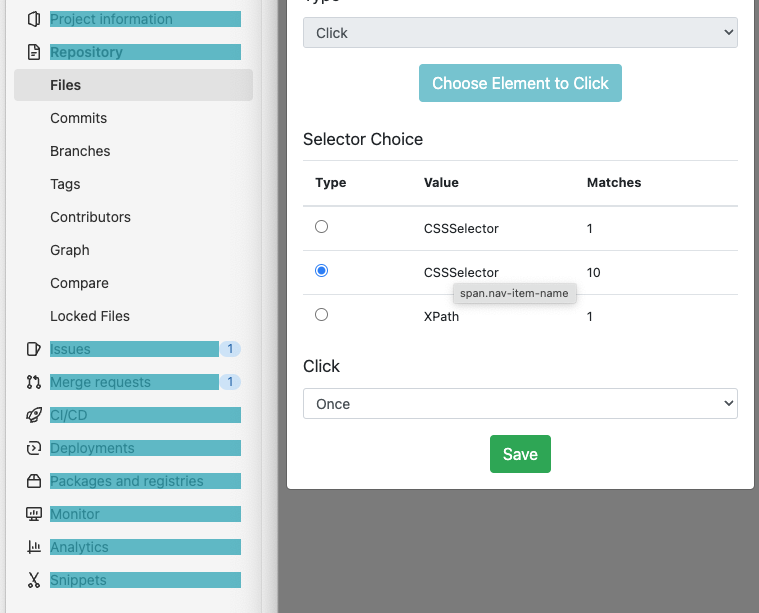

Memento Tracer Extension

About
=====

The Memento Tracer Extension records a user’s interactions with a web page . The extension captures these interactions and saves them as a JSON file–essentially, a set of instructions or a template for the web crawler. This set of instructions can then be used to crawl websites with identical formatting. These JSON files are useful for websites like GitHub or SlideShare, where a user wants to make sure certain elements on nearly-identical pages are captured each time. It’s kind of a middle ground between a largely automated web crawler like the Internet Archive’s tools and the more manual web-crawling tool Webrecorder.

How it works
============

The JSON file that the browser extension produces identifies specific locations in the structure of a website. The idea behind this is that many websites have consistent organization and structure from page to page. For example, on a typical GitHub page, the menu bar is located across the top of the page; there is a button called “Issues,” and when you click on the “Issues” button, the browser will take you to a page that has a table of open issues. By identifying these commonalities in the page structure, you can capture similar elements on any iteration of a GitHub webpage with these elements.

CSS Selector vs. XPath
----------------------

When you click on an area to trace, the extension opens up a dialog box in which you must choose between a few different radio buttons, labeled “CSS Selector” or “XPath.” Each of these terms refers to a different way to look at and locate elements within the structure of a website.

A CSS (or Cascading Style Sheet) Selector identifies the places on a website to which a developer has applied a particular set of styling characteristics. For example, a set of buttons on a given website share such characteristics–they may all be located in a certain area of a page, have the same background color and text color, etc. XPath is a query language, which looks at XML or HTML documents as though they are large, hierarchical trees. An XPath query traverses the tree to find a certain item’s location.

Many people who scrape content from webpages prefer to use CSS Selectors when possible, for a few reasons. First, within a browser, a search for a CSS Selector generally moves faster than an XPath search. Also, if anything changes on the webpage, it can easily alter an object’s location in the “tree,” which would render the XPath selector invalid. It’s much less likely that a CSS Selector will change.

An XPath selector typically pinpoints the exact element on a page with more accuracy than a CSS selector.  Sometimes, that’s helpful, but in other cases, it’s actually too specific. For instance, the XPath selector for the “Next” button in GitHub is:

"id(\\"repo-content-pjax-container\\")/DIV\[1\]/DIV\[5\]/DIV\[1\]/A\[2\]" if the issue tab has 2 pages of results, but

"id(\\"repo-content-pjax-container\\")/DIV\[1\]/DIV\[5\]/DIV\[1\]/A\[8\]" if the issues tab has 8 pages of results.

That means that a trace using the XPath selector for this button would not be generic enough to work on any GitHub page–who knows how many pages of results the issues page might have? In contacts, the CSS Selector is “a.next\_page” – a much more generalizable option.

In general, we advise you to use a CSS selector when possible. Occasionally, you will find that the CSS Selector highlights too broad a range of links, or will not highlight the specific link you want; in that case, try the XPath selector to see if that works.

Using the browser extension
===========================

Open the browser extension on the first page of the website you wish to trace. Double-check the  website at the top of the page:

If this URL is incorrect, click the “Start Over” button at the bottom of the window. You can also click the “Load Trace” button to load the JSON file for a previously-created trace that you wish to modify.

You will create a series of instructions for the crawler to follow, navigating through the website and selecting the links or groups of links you wish to capture as you go.  

Each step of the process is called an “event.” Although you don’t have to name each event, it will help you keep track of the steps you have told the crawler to take, and will assist in troubleshooting. You can edit the name of an event at any time by clicking the black pencil button to the right of an event title.

Clicking the green plus button will create an event that is one step down in the hierarchy from the event you have clicked. In the above example, clicking the green plus button next to “click\_all” would create an event hierarchically below “click\_all,” while clicking the button next to “click\_pulls” would create an event at the same level of the hierarchy as “click\_all.”

Clicking the red delete button deletes an event and all events hierarchically beneath it. In the above example, if a user clicked the delete button on “click\_pulls”, both “click\_pulls” and “click\_all” would be deleted.

Types of Clicks
---------------

There are 4 types of events: Click, Click All, Hover, and Scroll.

1\. Click

The “Click” action instructs the crawler to click on a single CSS or XPath element. This might seem obvious! There are a few important details to know about the Click action, though.

First, “Click” moves iteratively. A single click could navigate the crawler to a new page, or could change the state of a page in other ways–for example, by opening a dropdown menu or a pop-up. Therefore, the next instruction has to reflect the new page or features that the crawler has encountered.

Sometimes, when you select “Click,” you’ll see multiple elements highlighted as possible CSS Selectors.  This screenshot shows the result of a single click on the “Repository” menu item

If you are interested in capturing all ten menu items, you might think that the second option is best. However, remember that the crawler will move iteratively, clicking first on “Project Information” and then awaiting subsequent instructions. In this case, the “Click All” option, which would download the contents of all these pages simultaneously, is a better choice. In general, when you use the “Click” option, it’s best to choose the selector that points to a single element.

Note that hovering the mouse over a row in the Selector Choice table will show you what the crawler will crawl, and will also show the name of the corresponding CSS or XPath element.

If at this stage you realize that you’ve highlighted the wrong area, simply click “Restart Selection” to choose a different area of the page.

Once you have chosen a selector, there are a few options within “Click” that can add additional functionality, which you can see in the dropdown menu

2\. Click Until

Click Until will continue to click on and crawl a selector until it reaches the designated stopping point. This is particularly useful for capturing a series of similarly formatted pages, such as repeatedly clicking a “Next Page” button for paginated results. When you select Click Until, you’ll have to tell the crawler what the stopping point should be:

*   Stop crawling until it reaches a specified point (which you will have to select)
*   Crawl only a designated number of  elements (ie. if there are 200 pages of results but you only need to crawl the first 10)
*   Crawl until there are no more pages to crawl (ie. the crawler will click “Next page” until there are no further pages left to capture)

“Click Until” can have hierarchical actions beneath it. For example, if you want to click every page of results, and then click all links on each page, your trace might look like this:

3\. Click Multi

Click Multi allows a user to create a loop. In addition to choosing a selector (or set of selectors) to click initially, you pick a selector called “Return condition” that the crawler should click once it has completed the set of steps. It’s a little hard to understand so here’s an example:

This screenshot shows a platform with an issues tab in the left hand sidebar, and two separate tabs for open and closed issues. Perhaps you want to click the open issues tab, click all the issues under that tab–and, in addition, click “next” through the pagination for all open issues. Then, you want to click the “closed” issues tab, and repeat the same set of actions.

There is a CSSSelector that includes both the Open and the Closed tabs. Choose this as the CSSSelector, and then pick the “Issues” tab as the sidebar as the Return condition–completing all the tasks and then returning to the main Issues page would represent the closing of the loop.

Then, add the steps you’d like the crawler to take on both the open and closed tabs–clicking the next button until there are no more pages, and downloading all links on the page.

The crawler should now do all these steps in a loop: Open>Download all>Next (until there are no more pages)>back to Issues>Close>Download all>Next (until there are no more pages)>back to Issues

4\. Click All

The Click All button will download all links in an area simultaneously. This is different from “Click” because Click All will grab everything in an area at once.

Multiple Selectors In the Same Area
-----------------------------------

HTML and CSS elements on a webpage can be layered on top of each other. Sometimes, what appears to be a single element will turn out to be several elements in one. For example:

Suppose you wanted to trace the tab on this menu labeled “All.”  It looks here like all you’d have to do would be to click on “All.” However, using the tracer, you’ll see that you can highlight different areas of this small section:

Each of these corresponds to a different CSS Selector, which will lead to traces of different pages (or parts of the page). In this example, clicking just the text “All” will lead to 202 matches on the page: 

Clicking the entire highlighted area around the “All” button, though, will lead to a single CSS selector, which seems like a better choice:

Sometimes, the same area includes multiple CSS selectors. On the webpage above, you can click on two different CSS Selectors for the “All” button, each of which have just one match. You will see which CSS elements they point to by hovering your mouse over the different lines in the Tracer Extension tool.

 

There’s no easy way to tell which CSS Selector will yield the desired result, so you may just have to try both and see which works best. In some cases, a CSS Selector will have a relevant name (which could be something like “a.state#all” for selecting the “All” tab in this example), which can be a clue.

Hover
-----

Scroll
------

Completing a Trace
------------------

When you have chosen all of the areas you wish to crawl, click “Save Trace.” This will allow you to save and download a JSON file. When you wish to execute a crawl of a website, you will load this JSON file into the crawler.

General tips
============

Log Out
-------

Always log out of a site you wish to make a trace for before you create a trace. Because the crawler itself will not log into a site, you have to account for any differences between the appearance of a page for a logged-in user and for someone viewing it from the outside. If a page will not be visible for a user who is not logged in, you may not be able to crawl it.

Overlapping areas
-----------------

Sometimes you cannot click exactly the group or area of links that you would like to click. In many cases, you can resolve this by changing from CSS to XPath selectors. In other instances, though, this is due to the structure of the page itself. The crawler works by looking at div groupings in the page’s html code. In other words, it groups together elements on the page that belong to the same div, meaning that you cannot necessarily select an arbitrary group of links to trace. You cannot select JavaScript elements, or an element on the page that is not coded as a div. At times, this can also make it hard to target only the exact links that you hope to capture and not a few irrelevant links as well.

If there are multiple separate groupings of links that contain the element or elements you would like to trace, you can also try creating two “click all links in the area” events that may overlap.

Trial and Error
---------------

For some pages, finding the exact area you want to trace and selecting it will be easy. In other cases, it will take a number of attempts to select and isolate the elements you want, to get the loop to return properly, etc. Remember that although the extension makes it look simple, what you are actually doing when you make a trace is quite complex: creating a program to look through the structure of a website and then iterate over certain elements. Websites are also not necessarily consistent from page to page. Humans create websites, and even though they try to do things consistently, they may accidentally do something differently in the way they code a certain button or menu item. Because the tracer assumes everything will be identical, it cannot account for these minor variations.

Shallow Hierarchy
-----------------

The crawler tends to have trouble going deep into hierarchical page structures–the more possible places on a page where it can click, the more opportunities it has to get stuck. If there are multiple areas of a single site you wish to crawl (for example, the “issues” section of a GitHub page and all open issues, as well as the “pulls” section of a GitHub page and all open pulls), it’s preferable to make a top-level event for each separately. If you wish to archive content that is relatively deep on a webpage (ie you have to click through a number of pages to get to the content you wish to crawl), it might be best to start a trace farther down in the hierarchy of the site (eg. start a trace on a page called “home/issues/all/open” instead of starting the trace at home and navigating down using the tracer) or to select a different web crawling tool.
